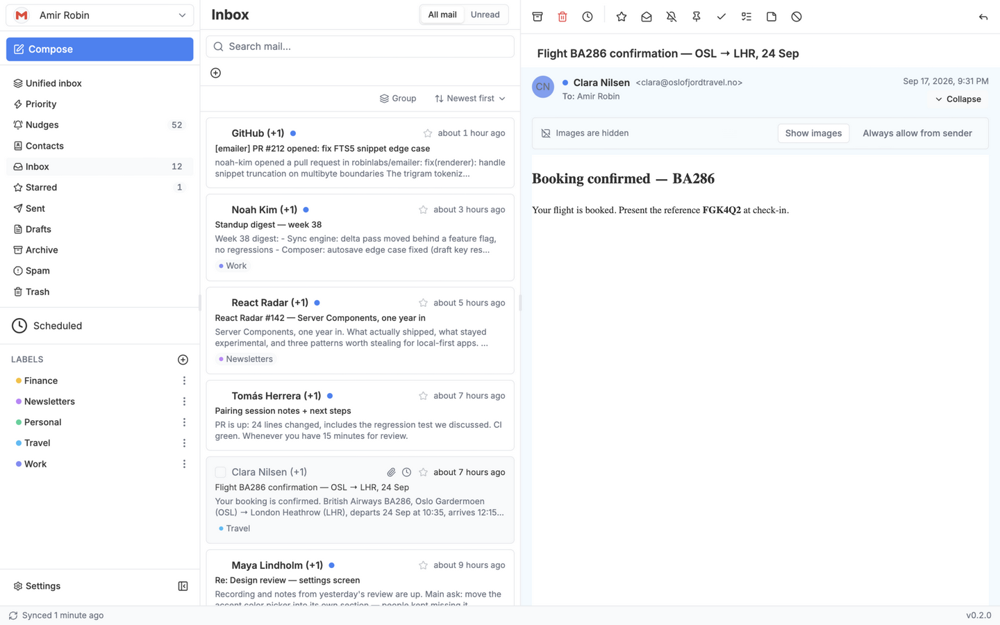
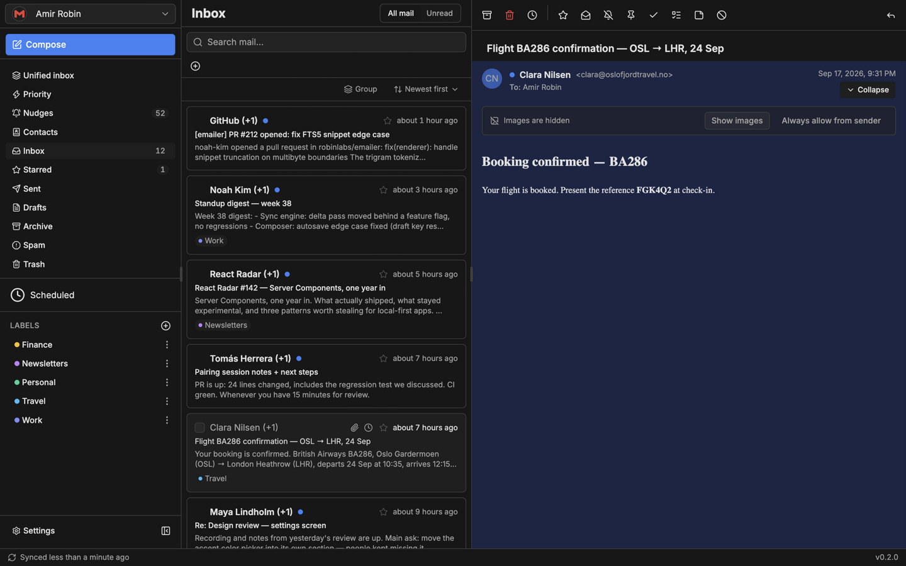
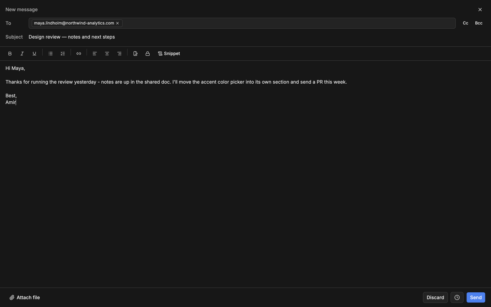
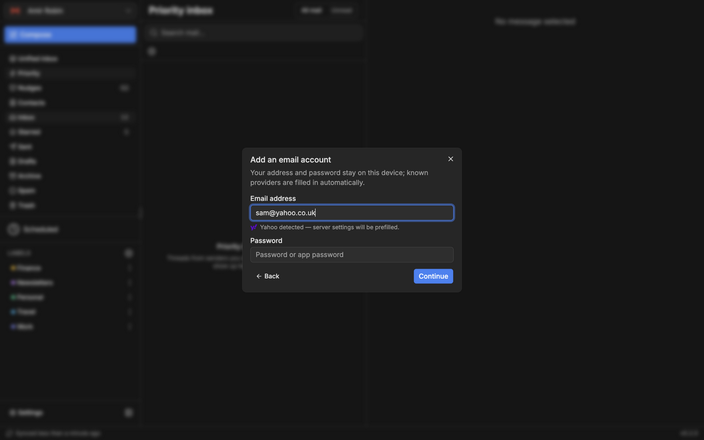

<p align="center">
  
</p>

<h1 align="center">emailer</h1>

<p align="center">
  A local-first desktop email client for Gmail and IMAP.<br/>
  Built with Tauri 2 — fast, native, and your mail stays on your machine.
</p>

<p align="center">
  <a href="https://github.com/AamiRobin/emailer/releases"></a>
  <a href="LICENSE"></a>
  
</p>

---

## Why emailer

Most email clients either hold your credentials hostage in the cloud or feel
like a web page in a frame. emailer is a real desktop app: your messages,
credentials and settings live in a local SQLite database, search and reading
work offline, and sync runs quietly in the background when you're online.

## Screenshots

**Inbox — light**



**Inbox — dark**



**Composer** · **Adding an account with provider detection**

 

## Features

- **Gmail and every major IMAP provider** — Gmail over its REST API with
  OAuth; IMAP/SMTP with server auto-discovery for Outlook, Yahoo, iCloud,
  Fastmail, GMX, Zoho and AOL — each with its brand icon across the app
- **Local-first storage** — everything lives on this machine; messages,
  search and drafts work offline and sync resumes when you're back
- **Unified inbox** — combine all accounts into one list (with per-account
  color attribution) or work per folder; priority inbox included
- **Search that keeps up** — full-text search with operators: `from:`,
  `to:`, `label:`, `is:starred`, `larger:5m`, `before:2026-01-01` — and
  negations like `-from:newsletter@` or `-has:attachment`
- **Reply tracking** — nudges resurface threads you haven't answered;
  follow-up reminders resurface threads that weren't answered *to you*
- **Local automation** — rules, junk filter, blocked senders and
  auto-archive run locally on every sync
- **A composer that gets out of the way** — rich text, snippets,
  attachments, per-account signatures, and an undo-send window
- **Encryption** — per-account OpenPGP keys with encrypt/decrypt in both
  the composer and the reader
- **Attachment security** — optional VirusTotal hash lookup before an
  attachment's first open (only the SHA-256 hash leaves the machine)
- **Keyboard-first** — command palette, full shortcut coverage and
  customizable bindings
- **Yours to theme** — light/dark, seven accent colors, density presets,
  reading-pane options

## Downloads & releases

Installers for Windows (installer + portable exe), macOS (Apple Silicon +
Intel DMG) and Linux (AppImage + deb) are on the
[Releases page](https://github.com/AamiRobin/emailer/releases). Two
channels, switchable in the app under **Settings → Updates**:

- **Stable** — tagged releases only (`vX.Y.Z`)
- **Beta** — prereleases (`vX.Y.Z-beta.N`) as soon as they build

The packaged app checks the channel's signed update manifest; release
engineering details live in [docs/releases.md](docs/releases.md).

## Stack

- **Frontend:** React 19 + TypeScript + Vite, Tailwind CSS 4, shadcn/ui,
  Zustand, Tiptap (composer)
- **Backend (Rust):** `async-imap`, `lettre`, `tokio` — connections are
  stateless: each command connects, works, and logs out
- **Storage:** SQLite (tauri-plugin-sql), OS keychain-backed credential
  encryption, Rust-managed attachment cache

## Development

```bash
bun install
bun run tauri dev      # run the desktop app in dev mode
bun run test           # vitest (frontend unit tests)
cargo test             # run inside src-tauri/ (Rust unit tests)
bun run build          # typecheck + production frontend build
```

### Connecting a Gmail account

Gmail uses Google's OAuth flow with **your own** free API client — no keys
are bundled with the app, and nothing is shared with third parties:

1. Open the [Google Cloud Console](https://console.cloud.google.com/) and
   create (or pick) a project.
2. Enable the **Gmail API** for that project (APIs & Services → Library).
3. Configure the **OAuth consent screen** (APIs & Services → OAuth consent
   screen): user type *External*, add yourself as a **test user**.
4. Create credentials: *OAuth client ID* → application type **Desktop
   app**.
5. In emailer: **Add account → Gmail**, paste the client ID, and sign in
   in the browser window that opens.

The app requests the `https://mail.google.com/` and `email` scopes and
receives the OAuth callback on a local loopback listener
(`http://127.0.0.1:17248`). Tokens are stored encrypted on this machine
and never leave it except to talk to Google's API directly.

### Run in a browser with mock data

```bash
bun run dev:mock       # http://localhost:3000
```

Serves the UI in a plain browser against an in-memory SQLite (official
SQLite WASM) seeded with a realistic two-account mailbox — threads,
labels, drafts, contacts, search all work. Tauri-only surfaces are
stubbed: account add/OAuth flows and attachment downloads are disabled,
sync commands report healthy empty results, and sends file locally only.
An amber "MOCK DATA" pill marks the mode. The desktop app and production
build are unaffected (the mock wiring only activates in `--mode mock`).

## Conventions

UI conventions, design tokens, and the email-content style-isolation rules
live in [docs/ui-guide.md](docs/ui-guide.md). In-progress change plans and
task breakdowns live in `openspec/` (local only, not committed).

## Security notes

The CSP keeps `script-src 'unsafe-inline'` deliberately: besides the resize
reporter inside the sandboxed email frame, `next-themes` (the theme provider)
injects a runtime inline script whose bytes come from minified library
internals — they cannot be pinned by a stable sha256 hash, and CSP3 ignores
`'unsafe-inline'` wherever a hash is present. Revisit if the theme provider is
ever replaced. See [SECURITY.md](SECURITY.md) for reporting vulnerabilities.

## License

[MIT](LICENSE)
